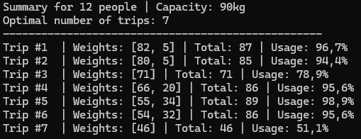
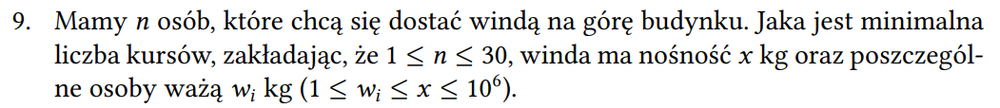

# 🛗 Bin Packing Elevator Problem

An efficient implementation of the **Bin Packing Problem** using an elevator/trip optimization scenario. The Bin Packing Problem is an NP-hard optimization problem.  
The program calculates the **minimum number of elevator trips** required to transport people without exceeding the elevator weight capacity.

The project uses a recursive **Backtracking + Branch & Bound** strategy to significantly reduce unnecessary computations and find an optimal solution efficiently.

---

## ✨ Features

- Solves the classic **Bin Packing Problem**
- Elevator-trip based simulation
- Displays detailed trip assignments
- Uses descending weight sorting heuristic
- Supports random test data generation

---

## 🧰 Tech Stack

- .NET
- C#
- Backtracking Algorithm
- Branch & Bound Optimization

---

## 🎲 Random Data Generator

The project includes a helper utility for generating valid random test cases based on assignment constraints:

- `1 ≤ n ≤ 30`
- `1 ≤ wi ≤ x ≤ 10^6`

---

## 🧠 How It Works

The algorithm recursively assigns people to elevator trips while ensuring the total weight does not exceed the elevator capacity.

### Main ideas

- Sorting Optimization (`weights.OrderByDescending(x => x).ToArray()`)
- Backtracking Algorithm
- Branch & Bound Pruning

Several optimizations are used:

1. Skip states already worse than the best solution
2. Avoid duplicate capacity states
3. Estimate lower bound using remaining weights
4. Early exit when elevator becomes perfectly filled

---

## ▶️ How To Run

- Check if .NET SDK (.NET 8+ recommended) is installed on your system:
 
```bash 
dotnet --version
```

- Run the project

Clone the repository:
```bash 
git clone https://github.com/pawelgawron3/bin-packing-problem.git
```

Go to project directory:
```bash
cd BinPackingElevator
```

Run application:
```bash
dotnet run
```

---

## 📥 Example Input

```csharp
int n = 12;
int x = 90;
int[] weights =
[
    34, 66, 32, 55, 54,
    46, 80, 82, 20, 71,
    5, 5
];

ElevatorProblem elevatorProblem = new ElevatorProblem(n, x, weights);
```

---

## 📸 Example Output



---

## 📜 License

This project is licensed under the MIT License - see the LICENSE file for details.

---

## 📝 Problem Description

Below is the original task statement provided in Polish language during the uni assignment:

